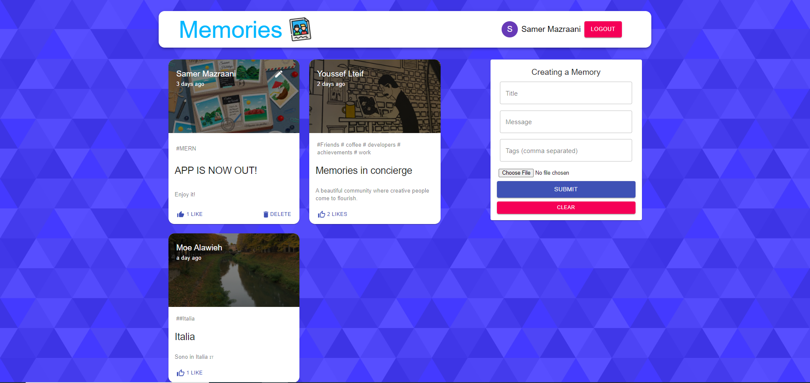
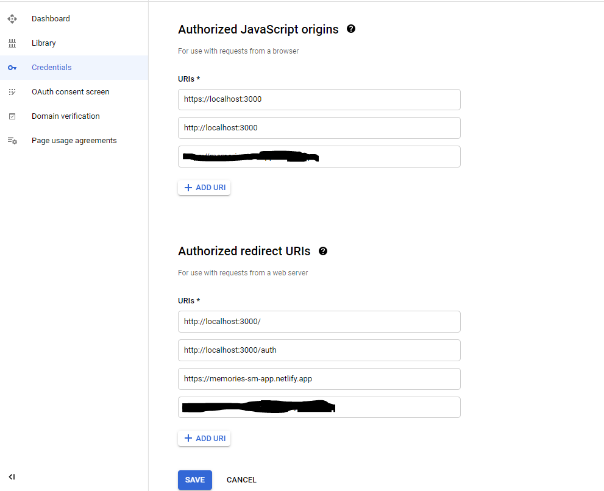

# memories-sm-project

https://memories-sm-app.netlify.app/

## Description
"Memories" is a simple social media app that allows users to post interesting events that happened in their lives.
It's a full stack MERN application using React, Node.js, Express & MongoDB and Material UI for the design.

## Installing the project
- Open your terminal and then type. `$ git clone {the url to the GitHub repo}`  
- cd into the new folder and type. `$ npm install`  
- To run the project. `$ npm start`

## GOOGLE_API_KEY using OAuth 2.0 to Access Google APIs 
-  Obtain OAuth 2.0 client credentials on https://console.developers.google.com/
- replace the clientid in line 136 in client\src\components\Auth with your own API_KEY
- fill the URIs below 
- 